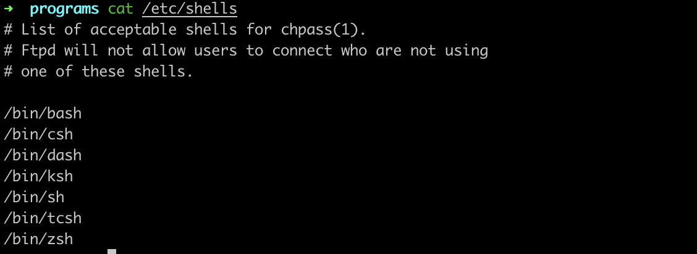
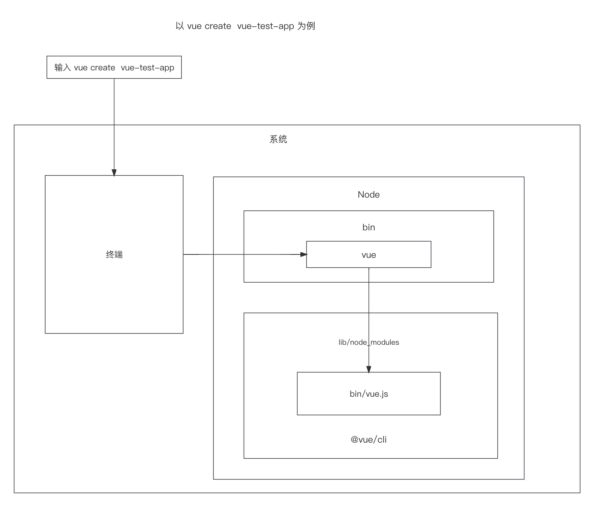

# 基本概念

## shell 和 bash

Shell： shell 是一个命令解析器，当输入命令后，由 shell 进行解析后交给操作系统内核进行处理。例如 copy 命令，在命令行面板输入 cp，那么 shell 会解析 cp 这个命令，后交给操作系统内核执行

Bash：bash 是一种可执行程序，是对 shell 的一种实现，例如，通过 `cat /etc/shells` 查看

查看当前使用的是哪种 shell，可以执行 `echo $SHELL`

Mac 上，经常是 zsh 而不是 bash，很大是因为 oh-my-zsh 这个配置集，它兼容 bash，还有自动补全等好用的功能

## 什么是 CLI

命令行界面（CLI）是一种基于文本的界面，类似 MacOS 终端、window 的 cmd.exe，用于运行程序，比如运行 bash

CLI 接收键盘输入，在命令符号提示处输入命令，然后有计算机执行并返回结果

综上，bash 是 shell 的一种实现，CLI 是 bash 的运行环境

## 脚手架基本流程

1. 在终端输入 `vue create vue-test-app`
2. 终端解析出 vue 命令
3. 在环境变量中找到 vue 命令
4. 终端根据 vue 命令链接到实际文件 vue.js
5. 终端利用 node 执行 vue.js
6. vue.js 解析命令参数（create、vue-test-app）
7. vue. js 执行命令
8. 执行完毕,退出执行

> 通过 which vue 查看 vue 命令所在的目录

从这个流程就可以看出，开发一个脚手架 vue-cli，需要：

1. 开发 npm 项目,该项目中应包含一个 bin/vue.js 文件,并将这个项目发布到 npm
2. 将 npm 项目安装到 node 的 1ib/node_ modules
3. 在 node 的 bin 目录下配置 vue 软链接指向 lib/node modules/ lvue/cli/bin/vue. js

这样我们在执行 vue 命令的时候就可以找到 vue. js 进行执行

## 脚手架基本原理

